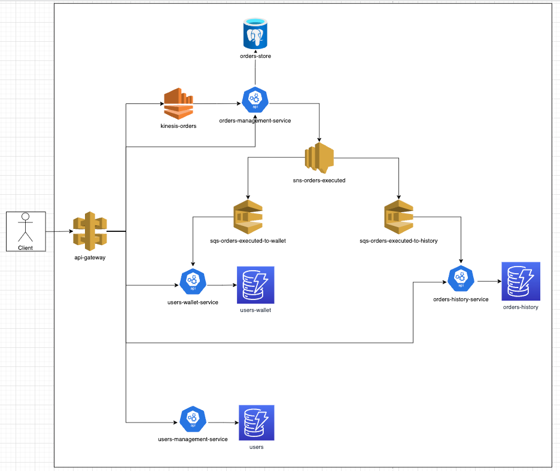

# Order Book Interview
> Creation of a service responsible for managing an order book.

## What it does?
* The task was to implement an order book service that managed buy and sell orders for a particular asset. A system was created to store all active orders, update them as new orders came in, and match buyers' bids with sellers' offers to execute trades. Additionally, the system was designed with scalability and high availability in mind to handle potential spikes in trading activity and minimize downtime.

## Who uses it?
* This system can be used by any client interested in a service that has the logic of orders book implemented.

## Architecture

## Technologies and Dependencies
* Golang 1.19.2
* PostgresSQL
* DynamoDB
* SNS
* SQS
* Docker

## Step-by-step guide to run the application:

1. Clone this repository on your local environment.
2. Open the script folder and access the file: `docker-compose.yml`.
   * Change the $ABSOLUTE_PATH variable to match your local environment [Line 9 and 57]. For example:
>$ABSOLUTE_PATH/orderbook/orders-management-service -> /Users/joao.vale/go/src/gitlab.com/projects/orderbook/orders-management-service
3. Go to the root of the project and run the command `$ make up` in the terminal. This command will start the script that will create the local environment and all the necessary functionalities to run the service.
4. To stop, just run the command `$ make down`.

