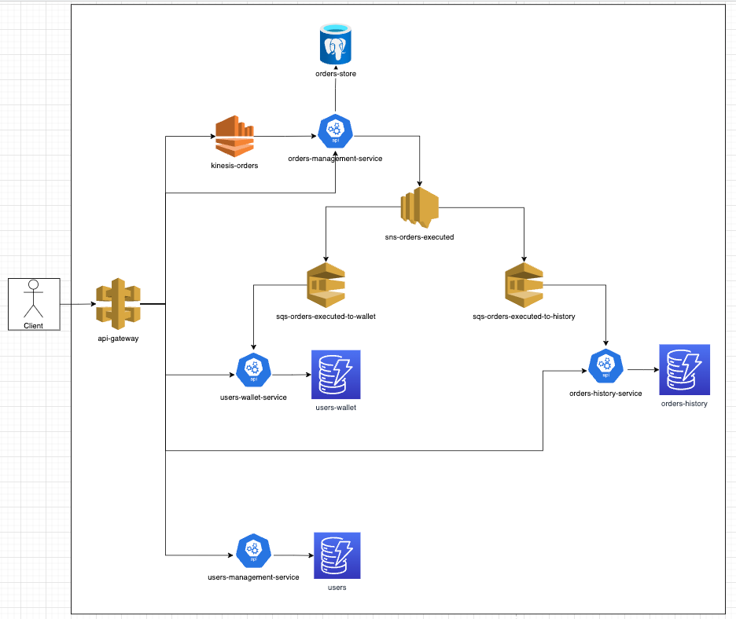

# users-wallet-service
> Service responsible for managing user wallets.

## What it does?
* Performs user validation (whether the user has sufficient balance and quantity of products for the operation), and manages a user's wallet.

## Who uses it?
* The order-book-management-service system uses this service to perform validations and indirectly send executed orders via SNS.

## Service outage impacts
* If this service goes down, executed orders will be stored in an SQS and can be reprocessed in the future.

## Architecture

## Technologies and Dependencies
* Golang 1.19.2
* SQS
* Docker

## Step-by-step guide to run the application:

1. Clone this repository on your local environment.
2. Open the *script* folder and access the file: `docker-compose.yml`.
   * Change the $ABSOLUTE_PATH variable to match your local environment [Line 9 and 57]. For example:
>$ABSOLUTE_PATH/orderbook/orders-management-service -> /Users/joao.vale/go/src/gitlab.com/projects/orderbook/orders-management-service
3. Go to the *root* of the project and run the command `$ make up` in the terminal. This command will start the script that will create the local environment and all the necessary functionalities to run the service.
4. To stop, just run the command `$ make down`.

## Collection Postman 

>Note: Collection is located at the root of the OrderBook-Collection project as OrderBook-Collection.postman_collection.json.